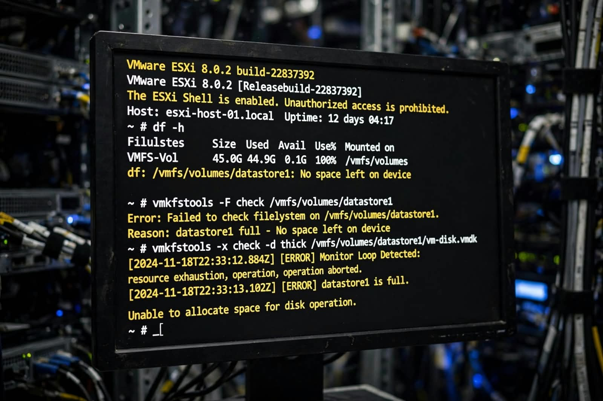
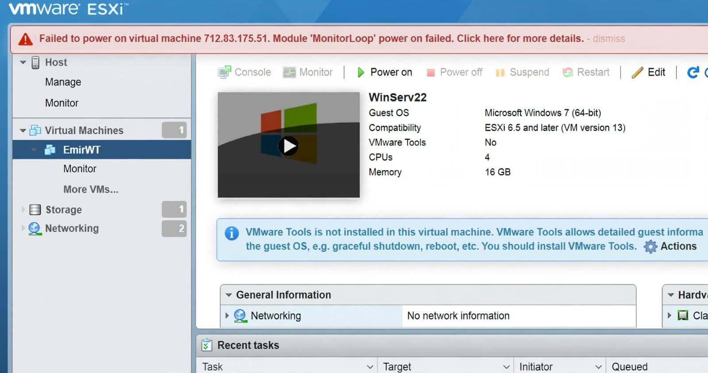
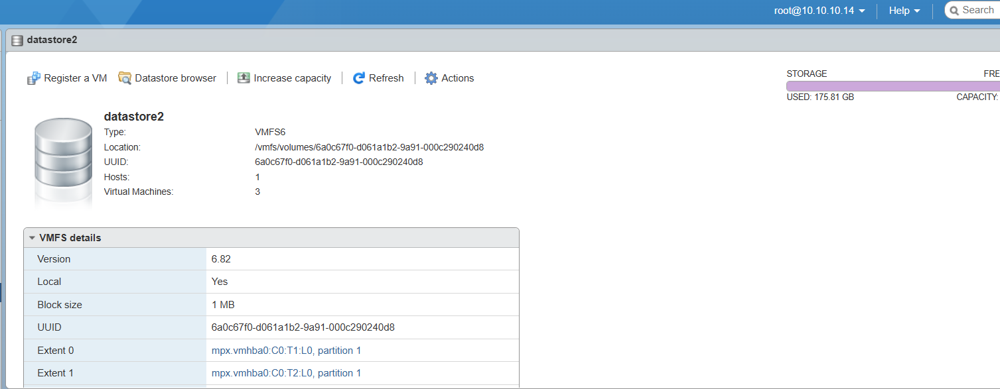
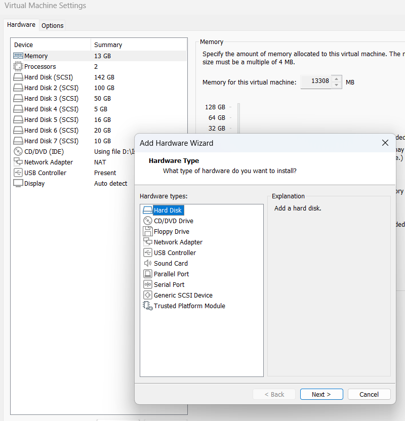

# ESXi Fix: Module 'MonitorLoop' Power On Failed - Datastore 100% Full

> **Root Cause:** When ESXi datastore becomes 100% full, VM cannot create swap/vswp files and fails with `Module 'MonitorLoop' power on failed`.

## The Problem

- **Host:** 10.10.10.14 / ESXi 6.5 - 8.0
- **Datastore:** `datastore2` - VMFS6 - 183.75 GB
- **Usage:** 98% (181GB / 0.5GB free) -> 100% Full
- **VM:** `WinServ22` (Windows Server 2022)
- **Error:** `Monitor Loop Detected — Critical - No space left on device. Datastore datastore1/datastore2 is full.`
- **Error on VM power on:** `Failed to power on virtual machine - Module 'MonitorLoop' power on failed.`

## The Fix: Increase Datastore Capacity

If you see Monitor Loop error, your datastore is full. The correct fix is to extend it.

### Steps to Fix

**1. Check Datastore Status**
In ESXi Host Client go to `Storage -> Datastores`. If `Free` is `0.00 B` and `Used` is `100%`, this is the cause.

**2. Add New Storage to Host**
- Insert new HDD / SSD to server
- Go to `Storage -> Storage Devices -> Rescan`

**3. Extend Datastore with Increase Capacity**
- Go to `Storage -> Datastores`
- Select your full datastore (`datastore2`)
- Click `Increase Capacity`
- Select `Add an extent to existing VMFS datastore`
- Select the new disk
- Click `Finish`

**4. Verify and Power On VM**
- Check `Storage -> Datastores` - Free space should now show (e.g., 320GB free)
- Go to `Virtual Machines -> WinServ22 -> Power On`
- VM will boot normally, Monitor Loop error gone.

## Why This Happens?
ESXi needs free space for VM swap files (.vswp) and snapshots. When no space left, Monitor Loop protection fails the power-on to prevent corruption.

## Best Practice
Keep datastore usage below 80%. Set alarm for 75% full.
